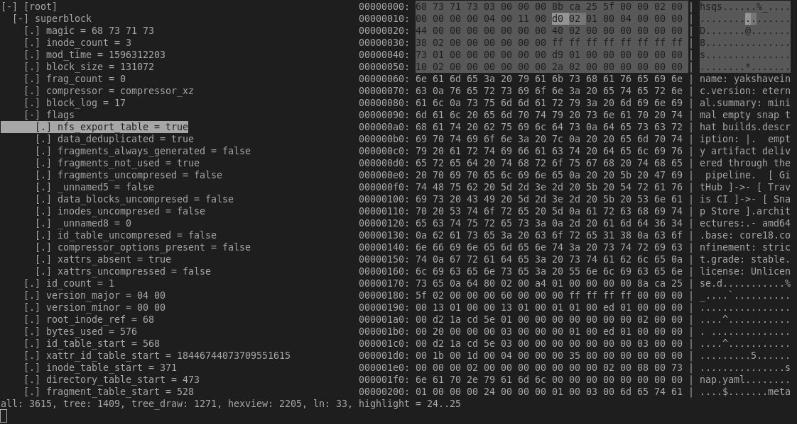

# Kaitai Struct: visualizer

This is a simple visualizer for [Kaitai Struct](https://github.com/kaitai-io/kaitai_struct) project.



Kaitai Struct is a declarative language used for describe various
binary data structures, laid out in files or in memory: i.e. binary
file formats, network stream packet formats, etc.

The main idea is that a particular format is described in Kaitai
Struct language (`.ksy` files) only once and then can be compiled with
this compiler into source files in one of the supported programming
languages. These modules will include a generated code for a parser
that can read described data structure from a file / stream and give
access to it in a nice, easy-to-comprehend API.

Please refer to [documentation in Kaitai Struct project](https://github.com/kaitai-io/kaitai_struct)
for details on `.ksy` files and general usage patterns.

## Downloading and installing

### Requirements
- [ksc](http://kaitai.io/#quick-start) - kaitai-struct-compiler
- [Java](https://openjdk.java.net/install/) 
- [Ruby](https://www.ruby-lang.org/)

### From Ruby Gems repository

KS visualizer is written in [Ruby](https://www.ruby-lang.org/) and is
available as
[.gem package](https://rubygems.org/gems/kaitai-struct-visualizer). Thus,
you'll need Ruby (RubyGems package manager comes bundled with Ruby
since v1.9) installed on your box, and then you can just run:

```shell
gem install kaitai-struct-visualizer
```

### Source code

If you're interested in developing the visualizer itself, you can check
out source code in repository:

```shell
git clone https://github.com/kaitai-io/kaitai_struct_visualizer
```

## Usage

```shell
ksv <binary-file> <ksy-file>... | <rb-file>
```

### Running with Docker

Running image from Docker Hub:
```shell
docker run -v "$(pwd):/share" -it kaitai/ksv <binary-file> <ksy-file>
```

Rebuilding the image from local files:
```shell
docker build . --tag docker.io/kaitai/ksv
```

## Licensing

Kaitai Struct visualizer is copyright (C) 2015-2021 Kaitai Project.

This program is free software: you can redistribute it and/or modify
it under the terms of the GNU General Public License as published by
the Free Software Foundation, either version 3 of the License, or (at
your option) any later version.

This program is distributed in the hope that it will be useful, but
WITHOUT ANY WARRANTY; without even the implied warranty of
MERCHANTABILITY or FITNESS FOR A PARTICULAR PURPOSE.  See the GNU
General Public License for more details.

You should have received a copy of the GNU General Public License
along with this program.  If not, see <http://www.gnu.org/licenses/>.

Note that it applies only to compiler itself, not `.ksy` input files
that one supplies in normal process of compilation, nor to compiler's
output files — that constitutes normal usage process and you obviously
keep copyright to both.
